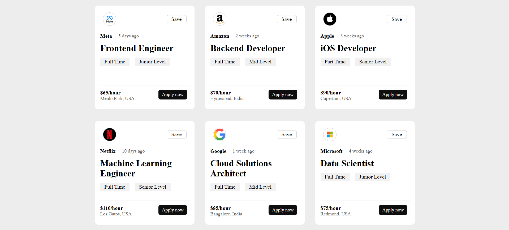

<h1>React Job Cards</h1>

A mini React project built using <strong>React</strong> and <strong>Vite</strong> to practice working with props and reusable components.
The application displays job listing cards dynamically using data passed through props.

<h2>Preview</h2>

<h2> Features</h2>

<ul>
    <li>Reusable React components</li>
    <li>Props-based data rendering</li>
    <li>Dynamic job listing cards</li>
    <li>Clean card-based UI layout</li>
    <li>Built with React and Vite</li>
</ul>

<h2>Technologies Used</h2>

<ul>
    <li>React</li>
    <li>Vite</li>
    <li>JavaScript (ES6+)</li>
    <li>CSS3</li>
</ul>

<h2>Concepts Practiced</h2>

<ul>
    <li>Props</li>
    <li>Component Reusability</li>
    <li>JSX</li>
    <li>Data-driven UI Rendering</li>
    <li>React Project Structure</li>
</ul>

<h2>Project Structure</h2>

<pre>
src/
├── components/
│   └── card.jsx
├── App.jsx
├── main.jsx
└── index.css
</pre>

<h2>What I Learned</h2>

<ul>
    <li>Passing data through props</li>
    <li>Creating reusable React components</li>
    <li>Organizing React projects</li>
    <li>Rendering dynamic UI content</li>
</ul>

